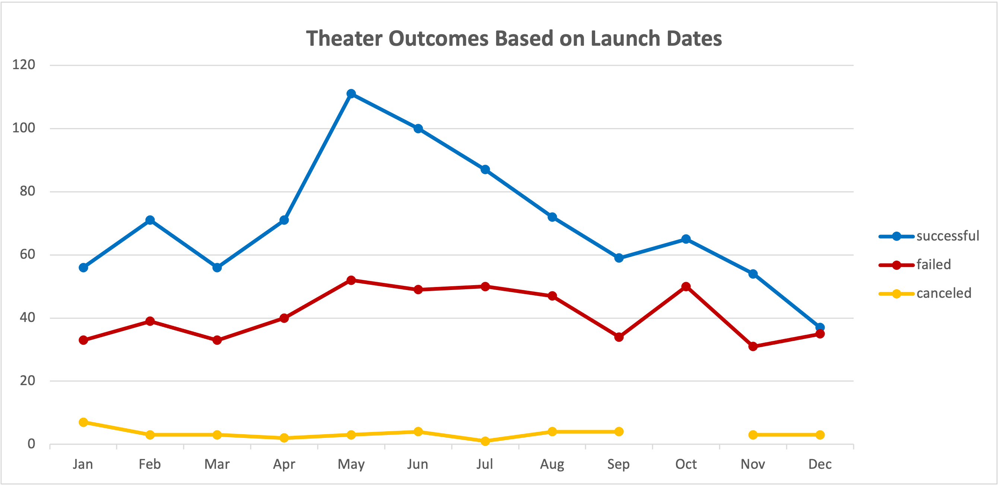
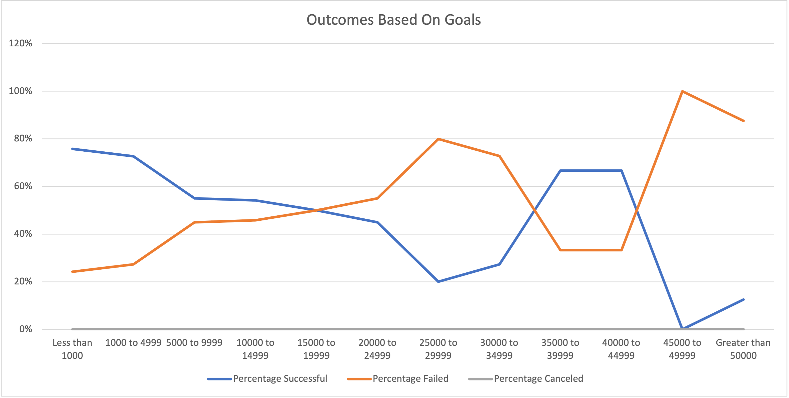

# Kickstarting with Excel
Gathering datasets to analyze and calculate how different campaigns fared in relation to their launch dates and their funding goals.

## Overview of Project
Louise’s play Fever came close to its fundraising goal in a short amount of time. Using the given Kickstarter dataset visualize campaign outcomes based on their launch dates and their funding goals.

### Purpose
This analysis will entail the creation of two analyses visualizations and a report detailing the outcomes and the findings of statics.

## Analysis and Challenges

### Analysis of Outcomes Based on Launch Date
The dataset is analyzed through a pivot table in an Excel workbook called Kickstarter_Challenge on the worksheet named Theater Outcomes by Launch Date. 

Data visulization Image:

### Analysis of Outcomes Based on Goals
The dataset is analyzed using formulas such as COUNTIFS() and SUM() in Excel workbook called Kickstarter_Challenge on the worksheet called Outcomes Based on Goals. 

Data visulization Image:

### Challenges and Difficulties Encountered
Using COUNTIFS(), I couldn't get the formula to function. Somehow my excels settings were not setup correctly. Fixed it by going to advanced settings > Use System Operators and checked it. 

## Results

- What are two conclusions you can draw about the Outcomes based on Launch Date?

  a) According to the analysis, May is the best month for theater outcomes as shown by the result of successful records.
  b) The highest canceled cases was in the month of January with a record of 7 cancels.

- What can you conclude about the Outcomes based on Goals?
  
  a) There were more successful outcomes recorded than failed outcomes.

- What are some limitations of this dataset?
  
  a) Different analysis formulas to validate data from different lenses to see data accuracy. 

- What are some other possible tables and/or graphs that we could create?
  
  a) A visualization can be created to compare the amount of failures to the amount of successful outcomes percentage wise.
